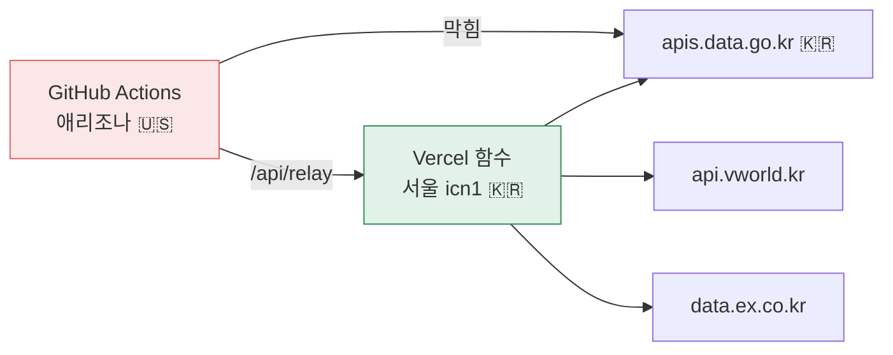

# 2막 · 미국에서는 문이 안 열린다

**2026-08-31 ~ 09-02**

---

## 404 가 404 가 아니었다

수집기를 GitHub Actions 에 올려 돌렸더니 전부 실패했습니다. 404 와 400 과
타임아웃이 섞여 나왔습니다.

> **나**
> 엔드포인트 주소가 틀린 거 아닌가요?

> **Claude**
> 그렇게 생각했습니다. 그런데 경로를 고쳐도 같은 코드가 나와서,
> **주소를 바꾸는 대신 주소를 없애 봤습니다.** 루트 URL 로 그냥
> 두드렸습니다.

루트에서도 똑같은 코드가 나왔습니다. 그러면 경로 문제가 아닙니다.

러너가 어디 있는지 확인했습니다 — **미국 애리조나 피닉스, Azure.**

---

## 측정 결과

| 대상 | DNS | TCP 연결 | 응답 | 판정 |
|---|---|---|---|---|
| `apis.data.go.kr` | 성공 (27.101.236.63) | **30초·60초 타임아웃** | 없음 | **차단** |
| `www.data.go.kr` | 성공 | **30초 타임아웃** | 없음 | **차단** |
| `api.vworld.kr` | 성공 (211.188.33.95) | 0.47초 | **502** (루트도 동일) | **거부** |
| `data.ex.co.kr` | 성공 (180.148.181.60) | 0.41초 | **400** (모든 경로 동일) | **거부** |

> **Claude**
> 두 가지 모양이 갈립니다.
> - **data.go.kr** — DNS 는 풀리는데 **TCP 3-way handshake 자체가
>   완료되지 않습니다.** 방화벽에서 조용히 버리는(drop) 전형적인 모습입니다.
> - **브이월드 · 도로공사** — 연결·TLS 는 정상인데 게이트웨이가 즉시
>   502 / 400 을 돌려줍니다. **루트 URL 과 모든 후보 경로에서 같은 코드**라
>   요청이 잘못된 게 아닙니다.
>
> 세 곳 모두 **키와 무관합니다.** 같은 실행에서 세 키가 다 정상 인식됐고
> (64자 / 36자 / 10자) 인증 오류 메시지는 한 번도 안 왔습니다.

> **나**
> 그러니까 코드 문제가 아니라...

> **Claude**
> **나라 문제입니다.** 수집은 한국 IP 에서 실행해야 합니다.

---

## 선택지 넷

| 방법 | 한국 IP | 필요한 것 |
|---|---|---|
| 국내 PC 에서 직접 실행 | ⭕ | 파이썬 설치 (1회) |
| 국내 PC 에 self-hosted 러너 | ⭕ | 1회 설치 후 버튼으로 원격 실행 |
| **Vercel 서울 리전(icn1) 함수를 중계로** | ⭕ | **중계 함수 개발** |
| 한국 클라우드 VPS | ⭕ | 월 비용 |

셋째를 골랐습니다. 이미 Vercel 에 배포하고 있었으니 서울 리전에 함수
하나를 세워 **중계기** 로 쓰는 것이 추가 비용 0 이었습니다.



중계기에는 두 가지 규칙을 넣었습니다.

| 규칙 | 왜 |
|---|---|
| `ALLOW` 허용목록 | 아무 데나 중계하면 공개 프록시가 된다 |
| `STRIP` — `key` 를 지운다 | **진짜 열쇠는 Vercel 환경변수에만 둔다.** 저장소에도 러너에도 들어오지 않는다 |

> **Claude**
> 러너가 보내는 요청에 자리표시자를 넣어 두면 중계기가 그걸 떼고
> 진짜 키를 끼웁니다. 그래서 GitHub 시크릿에 키를 안 넣어도 됩니다.

*(이 설계가 2주 뒤에 저를 한 번 물어뜯습니다 — 6막의 `REDT_RELAY_URL` 사건.)*

---

## 그런데 이 문서가 나중에 수집을 또 멈췄다

중계기 주소를 문서에 `https://toji.fyi/api/relay` 로 적어 뒀는데,
2026-09-10 에 실제로 그 값을 넣었다가 수집이 한 번 더 멈췄습니다.

> 응답 본문이 두 오류를 갈라 줬습니다 —
> `DEPLOYMENT_NOT_FOUND` 는 **도메인이 없는 것**이고,
> `The page could not be found` 는 **도메인은 살아 있고 경로가 없는 것**입니다.
> **상태코드(둘 다 404)만 보면 이 구분을 못 합니다.**

> **Claude**
> 이날 이후로 404 를 보면 본문을 먼저 읽습니다.

---

## 교통량 — 파일로 간다

API 로는 과거를 못 받는다는 것이 1막에서 확정됐으므로, 파일을 받기로
했습니다. 목표는 **2016~2025** 였는데 받다 보니 더 갔습니다.

### 09-02 · 2003 ~ 2025, 274개월

| | |
|---|---|
| 교통량 | 2003-01 ~ 2025-12 · **274개월** |
| 결측 | 2004-06 · 2010-10 (2개월) |
| 영업소 | 개통 확인 **252** · 좌측절단 231 · 폐쇄 확인 9 |

> **나**
> 왜 2003년까지 받았어요?

> **Claude**
> 토지·공장 가격은 경제 순환을 탑니다. 몇 해만 보면 **그 몇 해가
> 마침 어느 국면이었느냐**에 결과가 좌우됩니다. 순환을 한 바퀴 이상
> 담으려면 **금융위기(2008) 전후를 포함**해야 합니다.

### 그리고 이 시계열이 스스로를 검증했다

```
2003  145,023,580     —
2008  166,819,209  +0.0%   ← 금융위기. 23년 중 유일한 정체
2020  242,796,325  -2.9%   ← 코로나.  23년 중 유일한 감소
2025  283,002,379  +1.2%

누적 1.95배 · 연평균 3.1%
```

> **Claude**
> **두 위기가 정확히 제자리에 있습니다.** 이걸 겨냥해서 맞춘 게 아니라,
> 손상 행을 버리고 승계를 제외하고 관측일수로 나눈 뒤에 남은 모양입니다.
> 자료가 맞다는 가장 좋은 증거입니다.

### 결측 두 달은 채우지 않았다

| 달 | 무슨 일 | 결정 |
|---|---|---|
| **2010-10** | 포털에 원본이 없다 | 안 채운다. `observed_days()` 가 그 해를 334일로 세므로 월평균 비교에 지장 없고, **지어내면 그 달의 실제 개통·폐쇄를 가린다** |
| **2004-06** | 포털이 6월 요청에 **7월 파일**을 줬다 (내용이 행 단위로 동일) | 11개월로 둔다. 변환기가 이제 파일 이름이 아니라 **안의 날짜**로 판단한다 |

> **Claude**
> **파일 이름을 믿지 마세요.** 포털이 이름과 다른 내용을 주는 일이
> 실제로 있었습니다.

---

## 함정 하나 — 하이패스

> **Claude**
> 적재 전에 반드시 볼 것이 있습니다. TCS 자료는 **현금과 하이패스가
> 구분**되어 있습니다. 하이패스 이용률은 계속 올랐으므로,
> **현금분만 뽑아 연도별로 이으면 실제로는 늘어난 교통량이 급감한 것처럼
> 보이고 β 부호가 뒤집힙니다.**

`rollup` 이 구분값 분포를 출력하도록 만들어 뒀습니다. 이 함정은
**빠지기 전에** 막았습니다. 다음 막에서 부호가 실제로 뒤집혔을 때,
이 함정을 이미 지워 둔 것이 원인 추적을 크게 줄였습니다.

---

## 짝이 안 맞는 구간

| | 기간 | |
|---|---|---|
| 교통량 | 2003 ~ 2025 (23년) | **완료** |
| 거래 | 2006 ~ 2025 (20년) | **한계** — 실거래 신고 의무가 2006-01 시작. 그 이전은 국가가 안 갖고 있어 어떤 API 로도 못 받는다 |
| 짝지어 쓰는 구간 | 1년 시차라 **2006 거래 ↔ 2005 교통량** 부터 | |

> **Claude**
> 2003~2005 교통량은 짝이 없지만 버리지 않습니다. 장기 추세와
> **2·3년 시차 시험**에 씁니다. 2006년 거래에 3년 시차를 걸면
> 2003년 교통량이 짝이 됩니다.

---

## 그날 배운 것

1. **"경로가 틀렸나" 를 확인하려면 경로를 없애 본다.** 루트에서도 같은
   코드가 나오면 그건 경로 문제가 아닙니다. 이 한 수로 이틀을 아꼈습니다.

2. **상태코드는 두 오류를 못 가른다.** 본문을 읽어야 합니다.
   404 두 개가 전혀 다른 뜻이었습니다.

3. **결측은 채우지 않는다.** 지어낸 값은 그 자리에 있던 진짜 사건
   (개통·폐쇄)을 가립니다. 비어 있는 것이 정보입니다.

4. **자료가 맞는지는 자료가 말해 준다.** 2008 과 2020 이 제자리에 있는
   것은 우리가 맞춘 게 아니라 남은 모양이었습니다.

---

| ← | → |
|---|---|
| [1막 · 질문이 틀렸다](01-the-wrong-question.md) | [3막 · 부호가 반대다](03-the-sign-was-backwards.md) |
