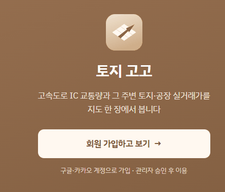
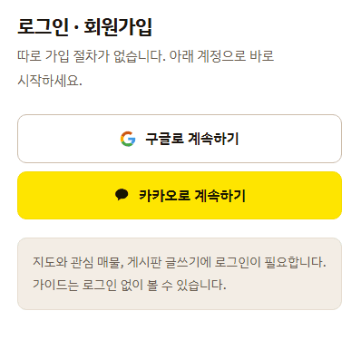
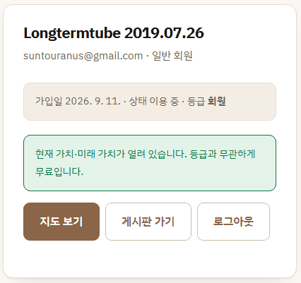
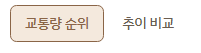
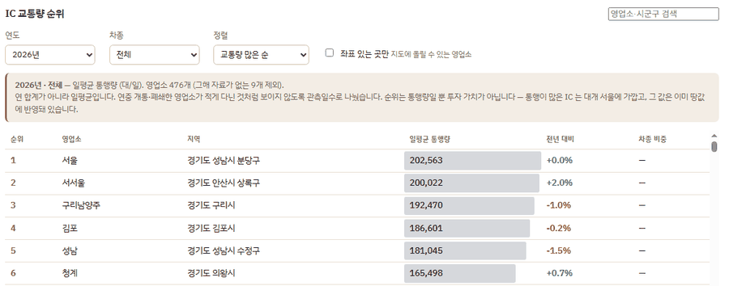

# 5막 · 토지 고고

**2026-09-10 ~ 09-13**

---

## 이름

> **나**
> 이름을 정합시다.

옛 이름 두 개(`사도 토지` · `사도될까`)를 버리고 **토지 고고** 로
갔습니다. 도메인은 **`toji.fyi`**.

### 마크


> **Claude**
> 위에서 내려다본 **필지**(밝은 마름모, 분할선 있음)를 **도로**가
> 가로질러 오른쪽 위로 뻗어 나갑니다. **도로가 곧 화살표입니다** —
> 교통량이 곧 미래가치라는 이 서비스의 가설을 그대로 그린 것입니다.

4막에서 축이 바뀌었는데도 마크는 그대로 뒀습니다. 도로가 중심이라는 점은
오히려 더 맞게 됐으니까요.

### 색 — 파스텔 위에 흰 글씨를 안 쓴 이유

| 쓰임 | 값 | 비고 |
|---|---|---|
| accent (글자·버튼·링크) | `#8A6547` | 흰 배경 대비 **5.2:1 — WCAG AA 통과** |
| accent-soft (배경) | `#F4E9DD` | |
| 다크모드 accent | `#D8B18C` | 어두운 배경 대비 **8.7:1** |
| brand-warm (점·띠) | `#C9A47C` | |
| 히어로 그라데이션 | `#9C7454` → `#7C5A3D` | 160deg |

> **Claude**
> 파스텔은 **배경에**, 진한 갈색은 **글자·버튼에** 씁니다.
> 파스텔 톤 위에 흰 글씨를 얹으면 명도 대비가 모자라 안 읽힙니다.

### 토큰은 한 곳에

09-12 에 `public/lib/theme.css` 하나로 모았습니다. 랜딩 · 가이드 ·
게시판 · 계정 · 지도앱이 전부 이 파일을 부릅니다.

> **Claude**
> 어두운 값은 `--d-*` 로 **한 번만** 적고, 미디어쿼리와
> `[data-theme="dark"]` 는 그것을 옮겨 담기만 합니다 — 그래서
> **한쪽만 고쳐 어긋날 일이 없습니다.**

다만 지도앱의 **자료색**(용도지역 · 거래 종류 · 교통량 구간 · 거리 밴드)만
따로 남겼습니다.

> **Claude**
> 그 색들은 **서로 구별되는 것이 임무**라 브랜드와 같이 움직이면
> 안 됩니다.

---

## 그날 코드에서 호칭 294곳을 지웠다

> **나** *(2026-09-10)*
> 저장소를 공개로 돌릴 겁니다. F12 로 `app.js` 를 열면 주석이 그대로
> 보이잖아요.

그때 코드에 사람을 부르는 호칭이 붙은 지시문이 **294곳** 있었습니다.

> **Claude**
> **주석을 지우자는 것이 아닙니다.** 주석의 값어치는 '왜 이렇게
> 했는가' 에 있고, 그것이 있어야 같은 것을 두 번 안 깨뜨립니다.
> 값어치가 없는 것은 **누가 시켰는가** 입니다.
> **호칭만 걷어내고 근거는 남깁니다.**

그리고 자동 검사(`test_privacy.py §4`)를 만들어 다시 못 들어오게
막았습니다. 재미있는 문제가 하나 있었습니다.

```python
# **호칭을 조각으로 만든다.** 여기에 통째로 적으면 이 검사 파일 자신이
# 걸린다. 검사가 자기를 잡고 영원히 빨간 것은 검사가 아니다.
_HONORIFICS = tuple(a + "님" for a in ("사장", "대표", "회장", "부장"))
```

*(이 검사는 5일 뒤에 저를 한 번 잡습니다 — 7막에서.)*

같은 검사에 이런 것들도 같이 들어갔습니다.

| 검사 | 무엇 |
|---|---|
| 1 | 추적 파일에 **전화번호 · 주민번호 모양**이 있는가 |
| 2 | 도시개발 수집기가 **연락처 칸을 받자마자 버리는가** |
| 3 | 이력에 남은 키 — 공개 전환 전 **재발급 필요**를 문서가 지목하는가 |
| 4 | **호칭** |

> **Claude**
> 2번이 중요합니다. 파일에서 지우기만 하면 **다음 수집이 그대로 다시
> 넣습니다.** 받는 자리에서 버려야 한 번 고친 것이 유지됩니다.
>
> 그리고 3번 — **저장소를 public 으로 바꾸면 되돌릴 수 없습니다.**
> 한 번 공개된 커밋은 남이 복제해 가고, 다시 private 으로 바꿔도 그
> 복제본은 안 사라집니다. '나중에 지우면 된다' 가 성립하지 않습니다.

---

## 첫 화면 — 방법을 설명하지 않는다

회의에서 지적이 나왔습니다.

> **나** *(2026-09-12, 회의록)*
> 논문 검토, 도로공사 월별 교통량 270개 파일, 실거래 1,230만 건 분석.
> 화물차 2~5종 + 관리/생산관리/생산녹지로 변수를 좁히자 상관관계가
> 명확히 나왔다. **그 과정은 사용자에게 의미 없다.** "왜 교통량을
> 봐야 하는지" 를 초보도 납득하게 첫 화면에서 설명해야 한다.
> **검증 방법이 아니라 필요성이 먼저.**

그래서 첫 화면은 이 순서가 됐습니다.

```
기제 세 마디 → 단서 한 마디 → 신뢰 수치 → 사례 셋 → 인과가 아니라는 한 마디
```

### 기제 — 왜 화물차인가

1. 공장에 운송비는 **매달 나가는 고정비**다.
2. 그래서 공장은 IC 근처에 모인다 — 국가산업단지의 **58.6%**,
   지방산업단지의 **61.6%** 가 IC 10km 안 (국토연구원).
3. 모이면 공장·창고가 들어올 수 있는 용도지역의 땅이 줄어든다.

### 단서 — 가까울수록 좋다는 뜻이 아니다

> **Claude**
> IC 바로 옆은 **소음·진출입 제약으로 값이 낮고** 2~4km 쯤에서
> 정점을 찍는다는 연구가 있습니다(오흥운·김태호 2009).
> 우리 자료에서도 정점이 밴드 경계에 있습니다 — 공장 1–3km, 토지 3–5km.
>
> **빨대효과도 남아 있습니다**(김윤식 2009). 차가 머무는 게 아니라
> 지나가는 곳이면 교통량이 늘어도 값은 안 오릅니다.
> 그래서 첫 화면에 **"교통량이 값을 올렸다" 고 쓰지 않았습니다.**

3막의 음수 계수가, 문헌에서 이미 예고돼 있던 것이었습니다.

---

## 캡처 여섯 장 — 손으로 안 찍는다

> **나** *(2026-09-12, 지시 원문)*
> '무엇을 보여주나'·'자료' 두 칸은 삭제(숨김)하고, 우리 서비스에서
> 사용자가 할 수 있는 것들을 넣읍시다. **실제 화면 캡쳐**로 나열해
> 주세요 — 시군구동별 용도지역별 실거래가와 추이, IC 차종별 통행량,
> 전국 실거래가 조회, 회원가입 시 현재 가치 예상. 우리 서비스가 할 수
> 있는 것과 **우리만 할 수 있는 것**을 강조해 주세요.

| 파일 | 무엇 | 어떻게 |
|---|---|---|
| `map.webp` | 전국 — 시·도별 평당가 | 사람이 찍음 |
| `region.webp` | 읍·면·동·리 평당가 | 사람이 찍음 |
| `cadastral.webp` | 지적편집도 — 필지 경계 + 동별 평당가 | 사람이 찍음 |
| `parcel.webp` | 필지 진단 여섯 축 (**지번 모자이크**) | 사람이 찍음 |
| `trend.webp` | 화물 통행량 × 실거래가 (지수) | **스크립트** |
| `rank.webp` | IC 차종별 통행량 순위 | **스크립트** |
| `value.webp` | 현재 가치 산출표 | **스크립트** |

> **Claude**
> 손으로 안 찍습니다. **화면이 바뀌면 첫 화면의 그림도 같이 낡는데,
> 손으로 찍으면 아무도 그것을 모릅니다.** 스크립트로 두면 한 줄로 다시
> 찍고, **무엇을 찍었는지가 코드에 남습니다** — 어느 탭, 어느 필터,
> 어느 연도였는지.

다듬기도 규칙으로 못박았습니다 — **자르기 · 줄이기(폭 1100) ·
WebP(품질 80)** 뿐. **그림 안의 무엇도 고치지 않습니다.**
여섯 장 합쳐 267KB, 검사가 500KB 를 넘는지 봅니다.

---

## 09-13 · 슬라이드 4쪽

> **나**
> 구글 슬라이드에 수정사항 정리해서 올렸습니다.

「토지 고고 수정」 4쪽. 아래 캡처는 **그때의 실제 화면**입니다.

### 2쪽 — 로그인 · 회원가입 · 프로필

<table>
<tr>
<td width="33%"><br><sub><b>수정 전</b> · 지도를 보려면 「회원 가입하고 보기」 를 한 번 거쳐야 했다</sub></td>
<td width="33%"><br><sub><b>수정 후</b> · 구글/카카오 단추가 첫 화면에 바로</sub></td>
<td width="33%"><br><sub><b>수정 후</b> · 내 계정 — 지도 · 게시판 · 프로필 · 로그아웃</sub></td>
</tr>
</table>

> **나** *(지시 원문)*
> 현재 화면에서 구글/카카오 계정 로그인, 회원가입 보여 줌. 즉,
> 지도/게시판/개인 프로필을 보기 위한 **한 단계 삭제**.
> 로그인/회원 가입 시 지도보기/게시판/프로필 수정(추가)/로그아웃 화면
> 보여 줌. 프로필 수정에서는 개인 사진 등록 또는 이름 수정.
> **저장 공간 및 서비스 한도가 문제된다면 프로필 수정은 추가하지 않음.**

| 요청 | 결과 |
|---|---|
| 한 단계 삭제 | ✅ 첫 화면 머리와 「이용」 칸에 구글·카카오 단추가 바로 |
| 로그인 뒤 화면 | ✅ `/account` — 지도 · 게시판 · 프로필 수정 · 로그아웃 |
| 이름 수정 | ✅ 표시 이름 2~20자. **본인 행만** 고칠 수 있고 등급·상태 열은 서버가 막는다 |
| **사진 등록** | ⏸ **넣지 않았습니다** — Supabase Storage 한도가 걸려 지시대로 보류 |

> **Claude**
> 사진 대신 **이니셜 아바타**(저장 공간 0)로 대체할 수 있습니다.
> 필요하면 말씀해 주세요.

### 3·4쪽 — IC 교통량

<table>
<tr>
<td width="25%"><br><sub><b>수정 전</b> · 탭 두 개</sub></td>
<td width="75%"><br><sub><b>수정 전</b> · 부가 설명 · 「전년 대비」 열</sub></td>
</tr>
</table>

| 요청 | 결과 |
|---|---|
| 「교통량 순위」 → **「IC 교통량」** | ✅ |
| 「추이 비교」 탭 삭제 | ✅ 접었습니다. 화면은 남아 있고 주소 끝 `#trend` 로 열립니다 |
| 표에 **「지가 추이」 단추** 추가 | ✅ 통행량과 YoY 사이. 누르면 교통량 × 지가 × 공시지가가 **팝업**으로 |
| 부가 설명 삭제 | ✅ 한 줄 요약은 제목에 마우스를 올리면 툴팁으로만 |
| 영업소·시군구 **검색 색인** | ✅ 영업소 이름 전부 + 시·도 + 시·군·구 목록. 골라도 되고 적어도 됩니다 |
| 「전년 대비」 → **최근 5년 YoY** | ✅ 막대 다섯 개 (위 증가 · 아래 감소 · ±15% 에서 자름) + 오른쪽에 최근 값 |

> **Claude**
> 「지가 추이」 단추는 **반경 지가 자료가 있는 영업소에서만** 켜집니다.
> 없는 곳은 흐리게 둡니다 — 눌렀는데 빈 팝업이 뜨는 것보다 낫습니다.

---

## 그날 배운 것

1. **공개 저장소는 되돌릴 수 없다.** 그래서 '나중에 정리' 가 없습니다.
   호칭 294곳은 공개 **전에** 지워야 했고, 다시 안 들어오게 검사를
   붙여야 했습니다.

2. **주석에서 지울 것은 '누가' 지 '왜' 가 아니다.**

3. **사용자에게 방법을 설명하지 마라.** 270개 파일과 1,230만 건은
   우리에게 자랑이고 사용자에게는 소음입니다. 먼저 답할 것은
   **"왜 이걸 봐야 하는가"** 였습니다.

4. **캡처를 손으로 찍으면 낡는 것을 아무도 모른다.** 스크립트로 찍으면
   무엇을 찍었는지가 코드에 남습니다.

5. **한도가 걸리면 기능을 반쯤 넣지 않는다.** 사진 업로드는 "일단
   넣고 나중에" 가 아니라 **안 넣고 그 이유를 적었습니다.**

---

| ← | → |
|---|---|
| [4막 · 도로를 접하는 가](04-the-road.md) | [6막 · 하루에 세 번 틀리다](06-three-mistakes-in-one-day.md) |
