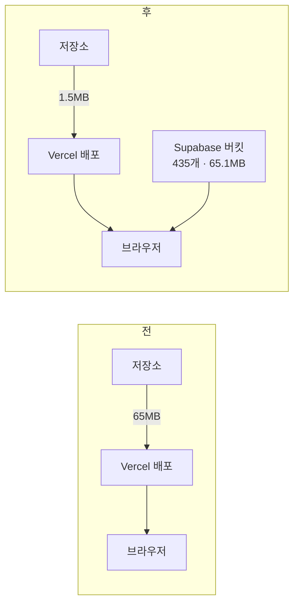

# 6막 · 하루에 세 번 틀리다

**2026-09-14**

---

이 장은 하루짜리입니다. 그리고 이 제작기에서 제가 가장 많이 틀린 날입니다.
**같은 종류로 세 번** 틀렸습니다 — *확인하기 전에 그럴듯한 이야기를 먼저
만들었습니다.*

---

## 아침 · 26.76 GB

> **나**
> Vercel 사용량 화면인데요, 뭐가 넘친 것 같습니다.

넘친 것은 하나였습니다.

| 항목 | | |
|---|---|---|
| **Deployment Storage** | **26.76 GB / 10 GB** | **268%** 🔴 |
| Edge Requests | | 80% |
| 나머지 | | 여유 |

까닭을 쟀습니다.

```
public/                 65 MB
  └ public/app/data/    64 MB   ← 98%
data 를 빼면            1.5 MB
```

그리고 최근 백 커밋 중 `public`·`api`·`vercel.json` 을 건드린 것은
**열일곱** 뿐이었습니다.

> **Claude**
> 여든셋은 `docs/` 나 `src/` 만 고쳤는데도 **65MB 짜리 배포를 하나씩
> 남겼습니다.** 배포를 건너뛰는 조건을 답니다.
>
> ```
> git diff --quiet HEAD^ HEAD -- public api vercel.json
> ```
>
> 없으면 0(건너뜀), 있으면 1(짓는다). 첫 배포에서는 `HEAD^` 가 없어
> git 이 실패하는데, 그러면 **짓는 쪽으로 넘어집니다** — 안전한 쪽이
> 기본값입니다.

그리고 이렇게 적었습니다.

> `26.76 GB ÷ 65 MB ≈ 배포 422 개분` — **산수가 딱 맞는다.**

### ❌ 오진 ①

> **나**
> 배포 목록이 너무 많아서 어느 걸 지울지 모르겠습니다. Claude 가
> 해 줄 수 없나요?

세어 봤더니 **`toji-gogo` 는 배포가 86개**뿐이었습니다(약 5.6GB).
주간 정리가 이미 돌고 있었습니다.

> **Claude**
> 아귀가 안 맞습니다. 그 사용량 화면은 **프로젝트 하나가 아니라 팀
> 전체**입니다. 이 팀에 프로젝트가 다섯입니다.
>
> 제가 앞서 적은 **'26.76GB ÷ 65MB = 422개분, 산수가 딱 맞는다' 는
> 틀렸습니다.** toji-gogo 한 곳으로 나눈 셈이었습니다.

86개를 3개로 줄였습니다(지금 도메인이 가리키는 배포를 API 로 확인해
지키고 최근 production 셋만 남김). 그런데 팀 전체를 세어 봐도 **122개**
뿐이었습니다.

> **Claude**
> 65MB 짜리가 86개여도 6GB 대입니다. **122개로는 26.76GB 가 안 됩니다.**
> 그 수치는 삭제를 늦게 반영하거나 청구 기간 누적입니다. 어느 쪽이든
> **더 지워서 내릴 수 있는 것이 아닙니다.**

> **Claude**
> 우연히 맞아떨어진 숫자를 근거로 삼았습니다. 문서 머리에 정정을
> 적습니다.

---

## 낮 · 65MB 를 1.5MB 로

> **나**
> 네 지금해주세요.

화면 자료를 배포에서 빼 Supabase 공개 버킷으로 옮겼습니다.



> **Claude**
> **공개 버킷인 까닭.** 이 자료는 이미 `toji.fyi` 에서 누구나 받던
> 것이라 옮긴다고 새로 열리는 것이 없습니다. 프리미엄 자료(격차율 표 ·
> 표준지 조각)는 그대로 **비공개** 버킷에 있고 여기 안 섞습니다.
>
> **그리고 이번 판에서는 저장소의 파일을 아직 안 지웁니다.** 버킷이
> 실제로 내보내는 것을 확인한 뒤에 지웁니다. 순서를 바꾸면 확인 전에
> 물러설 자리가 사라집니다.

### 확인을 두 번 했다

| 확인 | 왜 필요했나 |
|---|---|
| **열쇠 없이** 공개 주소로 다시 받기 | 올리기가 200 을 주는 것과 **브라우저가 받는 것은 다른 말**이다. 버킷이 비공개로 남아 있거나 경로가 틀리면 올리기는 멀쩡한데 화면만 빈다 |
| **CORS 머리글** | 화면이 이제 **다른 출처**로 부른다(`toji.fyi` → `supabase.co`). 머리글이 없으면 **curl 은 되고 브라우저만 막힌다** |

```
access-control-allow-origin: *   네 파일 모두   ✅
```

> **Claude**
> **하마터면 안 볼 뻔했습니다.** 사본을 뺀 순간 올리기 일감이 올릴 것이
> 없어 "없습니다" 하고 조용히 끝났는데 **작업은 success 로 찍혔습니다.**
> 초록불을 보고 넘어갔으면 CORS 를 영영 안 봤을 것입니다.

결과: 저장소에서 435개 · 65.1MB 를 빼고 **배포 65MB → 1.5MB (43분의 1).**

---

## ❌ 오진 ② · 한도 탓이 아니었다

배포가 계속 `ERROR` 였고 **빌드 로그가 한 줄도 없었습니다.**
저는 그것을 "한도를 넘겨 배포가 막힌 증상" 이라고 단정하고 문서에도
그렇게 적었습니다.

배포 상세를 열어 보니 까닭이 한 줄로 적혀 있었습니다.

```
The `vercel.json` schema validation failed with the following message:
should NOT have additional property `_ignoreCommand`
```

> **Claude**
> **제가 깨뜨리고 있었습니다.**
>
> 아침에 `ignoreCommand` 를 넣으면서 까닭을 `_ignoreCommand` 배열로
> 같이 적었습니다. JSON 에 주석이 없으니 밑줄 열쇠를 주석 삼은 건데,
> **`vercel.json` 은 스키마가 엄격해 모르는 속성이 하나만 있어도 배포를
> 통째로 거절합니다.**
>
> 그래서 그 커밋 이후 main 으로 간 배포가 전부 ERROR 였습니다.
> **한도와는 아무 상관이 없었습니다.** 빌드 로그가 비어 있던 것도
> 설정을 읽다 막혀 빌드가 시작조차 안 했기 때문입니다.
>
> `errorMessage` 한 줄을 안 읽고 그럴듯한 이야기를 먼저 만든 것이
> 잘못입니다 — 아침에 26.76GB 를 우연히 맞은 산수로 설명한 것과
> **같은 잘못**입니다.

---

## 오후 · 「응답 없는 페이지」

> **나** *(지시 원문, 2026-09-14)*
> 전국, 시/도, 구 단위의 축척에서는 실거래 표기를 하지 않습니다.
> 결국엔 확대(동/리 정도의 배율, 필지 구획이 보이는 기준)에서는
> **해당 조건의 실거래가 전부 표시** 되었으면 좋겠습니다.

배율 기준이 코드 열 곳에 흩어져 있어서 '구 단위' 같은 말과 `z` 숫자가
서로를 못 가리켰습니다. **문서를 먼저 만들었습니다** (`docs/map-zoom-levels.md`).

| 배율 | 무엇 |
|---|---|
| `z ≤ 13` | 표기 안 한다 |
| `z ≥ 14` | 조건에 맞는 것 **전부** (상한 없음) |
| `z ≥ 16` | 거기에 글자까지 — 필지 경계가 뜨는 배율 |

그리고 상한을 없앴습니다 (1,500 · 60 → 없음).

> **Claude**
> 자르면 '이 동네 거래는 이것뿐' 으로 읽힙니다. **못 그릴 사정이
> 생기면 자르지 말고 그리는 방식을 바꿉니다.**

몇 시간 뒤.

> **나**
> 「응답 없는 페이지」 가 떴습니다.

> **Claude**
> 제 탓입니다.
>
> 표식 하나가 DOM 요소 하나이고 그것을 **한 번에 동기로** 만듭니다 —
> 화면 안 건수가 크면 그 반복문이 주 스레드를 통째로 막습니다.
> 네트워크가 느린 것이면 로딩 표시가 뜨지만, 주 스레드가 막히면
> 브라우저가 저 대화상자를 띄웁니다. **그게 떴다는 것이 곧 동기
> 반복문이 범인이라는 뜻입니다.**
>
> **지시가 틀린 것이 아니라, 그리는 방식을 안 바꾸고 상한만 뺀 제가
> 틀렸습니다.** 제가 문서에 "못 그릴 사정이 생기면 자르지 말고 그리는
> 방식을 바꾼다" 고 적어 놓고, 방식을 안 바꾼 채 상한부터 뺐습니다.

되돌리되 예전보다는 크게 뒀습니다.

| | 전 | 없앰 | 되돌림 |
|---|---|---|---|
| `TRADE_DRAW_CAP` | 1,500 | Infinity | **3,000** |
| `TRADE_LABEL_CAP` | 60 | Infinity | **400** |

### 그리고 그 숫자도 감이었다 — 그래서 쟀다

진짜 Leaflet 에 진짜 divIcon 을 붙여 측정했습니다.

| 건수 | 모양 | 기기 | 시간 |
|---|---|---|---|
| 400 | 글자핀 | 휴대폰 | 1,216 ms |
| 3,000 | 점만 | 휴대폰 | 1,018 ms |
| **6,000** | **글자핀** | 휴대폰 | **19,610 ms** ← 멈춘 까닭 |

> **Claude**
> 지금 값의 최악은 1초 남짓이라 「응답 없는 페이지」 가 뜨는 자리가
> 아닙니다. **상한은 설계가 아니라 안전장치**라고 문서에 못박고,
> 검사도 '상한이 없어야 한다' 에서 **'상한이 있고, 자르면 말한다'**
> 로 바꿨습니다.

---

## ❌ 오진 ③ · 지도가 멎던 진짜 까닭

되돌렸는데도 지도가 여전히 멎었습니다. 저는 "검사판 가짜 지도 탓으로
보인다" 고 적었습니다. **틀렸습니다.**

> **나**
> 시·군·구 태그가 보이는 배율부터 멎습니다.

층을 하나씩 꺼 가며 좁혔습니다.

| 조건 | 결과 |
|---|---|
| z12 · 층 전부 끔 | 통과 |
| z12 · **지역 태그만 켬** | **멎음** |

고리는 이렇게 생겼습니다.


> **Claude**
> **못 받으면 캐시에도 대기 목록에도 안 남아 같은 조각을 영원히 다시
> 부릅니다.** 404 는 빨리 실패하므로 **더 빨리 돕니다** — 주 스레드가
> 그 고리에 갇혀 타이머 하나 못 돌고, 브라우저가 「응답 없는 페이지」
> 를 띄웁니다.
>
> **그리고 이것은 제 버킷 이전이 불러낸 것입니다.** 조각을 못 받는 일이
> 전에는 거의 없었는데, 화면이 버킷을 먼저 부르고 배포에서는 사본을
> 지웠으므로 한쪽이 어긋나면 **두 길 다 404** 가 됩니다.
>
> 아까 상한을 되돌린 것으로 안 나았던 게 당연합니다 — **상한과 아무
> 상관이 없었습니다.**

고친 뒤: 멎던 바로 그 조건에서 **몇 분 → 3~7 ms**.

---

## 저녁 · 고장 셋이 한 뿌리였다

지도 검사 **54건 실패**를 하나씩 파 들어가니 산출표의 세 조각이 전부
비어 있었고, 까닭이 한 줄이었습니다.

```
premiumFetch → "fetchData is not defined"
```

> **Claude**
> 버킷 이전 때 `fetchData` 와 `DATA_BUCKET` 을 `boot()` **안에** 뒀습니다.
> boot 안의 열여섯 자리는 됐지만, **밖에서 부르는 자리는 전부
> ReferenceError 로 죽었고 그 예외를 catch 가 삼켰습니다.**

| 증상 | 언제 |
|---|---|
| 조각을 '못 받았다' 로 읽고 → 다시 그리기 → 다시 받기 → 영원히 | 어제의 멎음 |
| 또래 표가 안 실려 시점수정 **'자료 없음'** | 오늘 아침 화면 |
| 검사판에서 산출표 세 조각이 비어 **54건 빨강** | 지금 |

> **Claude**
> **셋이 같은 뿌리였습니다.** 어제 고리를 끊은 것과 오늘 또래 표를
> 기다리게 한 것은 맞는 손질이지만 **뿌리는 아니었습니다** —
> 그 자리들은 여전히 조각을 못 받고 있었습니다.

넷을 module 첫머리로 올렸습니다. **지도 검사 483건 전부 통과**
(어제 429/54).

> **Claude**
> 교훈을 적어 둡니다. **예외를 삼키는 catch 는 검사도 같이 속입니다.**
> 검사는 '조각이 없다' 만 봤고, 왜 없는지는 예외를 기록하는 한 줄
> (`window.__premiumLast`)을 넣고서야 보였습니다.
> 조각을 받는 자리마다 마지막 실패 까닭을 남깁니다.

---

## 밤 · 시점수정을 고시대로

화면(안성 양성면 덕봉리): **「시점수정 자료 없음 · 산출 보류」**

까닭이 둘이었습니다.

**1.** `nowResults` 가 또래 표를 안 기다려 첫 산출은 늘 추세가 비었고,
로더가 **한 번 실패하면 영영 잠겼습니다** — 버킷이 잠깐 흔들린 첫 요청
하나가 그 뒤 모든 산출표를 '자료 없음' 으로 만들었습니다.

> **Claude**
> 어제 고친 조각 고리와 **같은 꼴**입니다 — *실패를 기억하되 다시는
> 안 하는.* 이제 기다리고, 실패는 60초 뒤 다시 받습니다.

**2.** 지가변동률이 **어디에도 안 이어져 있었습니다.**

> 고시 `[610-1.5.2.3.1]` — 시점수정은 "비교표준지가 있는 **시·군·구의
> 같은 용도지역**의 월별 지가변동률" 이다.

> **Claude**
> `time_factor` 에 자리는 있었는데 아무도 안 넣었고, 화면은 추세
> 갈래만 알았습니다. 문서가 **'가장 큰 어긋남'** 으로 적어 둔
> 그것입니다.

이어붙이면서 셋을 배웠습니다.

| | 배운 것 |
|---|---|
| 1 | 부동산원은 **'장안구' 처럼 구 이름만** 준다. 우리 이름은 '수원시 장안구' 라 못 이었다 — 마지막 마디로도 잇는다 |
| 2 | 지역별 표는 **법정동 단위**였다 — 한 달이 만 행이라 잘렸고, 용도지역별 표에 다 들어 있어 쓸 데가 없다 |
| 3 | **북구·동구·남구·서구·중구·고성군·강서구는 이름만으로 어느 시도인지 모른다.** 짐작으로 잇지 않는다 — 시·도 칸으로 물러나고 화면이 그렇게 적는다 |

---

## 이날의 오진 기록

| # | 내가 말한 것 | 실제 | 왜 틀렸나 |
|---|---|---|---|
| ① | "26.76GB ÷ 65MB = 422개분, **산수가 딱 맞는다**" | 팀 전체 수치를 프로젝트 하나로 나눔. 배포는 122개뿐 | **우연히 맞은 숫자**를 근거로 삼음 |
| ② | "빈 빌드 로그 = **한도를 넘겨 배포가 막힌 증상**" | 내가 넣은 `_ignoreCommand` 가 스키마 거부 | `errorMessage` **한 줄을 안 읽음** |
| ③ | "멎는 것은 **검사판 가짜 지도 탓**으로 보인다" | 진짜 화면의 무한 재요청 고리 | **확인 안 한 것을 추측으로 메움** |

> **Claude**
> 셋 다 같은 모양입니다. **확인하기 전에 그럴듯한 이야기를 먼저
> 만들었습니다.** 그리고 셋 다, 정정을 문서와 커밋에 남겼습니다 —
> 안 남기면 다음 사람이 그 틀린 이야기를 읽습니다.

---

## 그날 배운 것

1. **초록불을 믿지 마라.** 올릴 것이 없어 조용히 끝난 일감도 `success`
   로 찍힙니다. 로그를 끝까지 읽어야 합니다.

2. **200 과 "브라우저가 받는다" 는 다른 말이다.** 그리고 curl 이
   받는 것과 브라우저가 받는 것도 다른 말입니다(CORS).

3. **실패를 기억하되 다시는 안 하는 것도 버그다.** 반대로, 실패를
   아예 안 기억하는 것도 버그입니다. **얼마 뒤에 다시** 가 정답입니다.

4. **예외를 삼키는 catch 는 검사도 속인다.** 실패 까닭을 어딘가에
   남겨야 합니다.

5. **지시가 옳고 구현이 틀릴 수 있다.** "전부 표시" 는 옳은 지시였고,
   상한만 빼고 그리는 방식을 안 바꾼 것이 틀린 구현이었습니다.

6. **감으로 고른 숫자는 재서 바꾼다.** 3,000·400 도 감이었고,
   재고 나서야 근거가 생겼습니다.

---

| ← | → |
|---|---|
| [5막 · 토지 고고](05-the-product.md) | [7막 · 저울과 문](07-scales-and-gates.md) |
