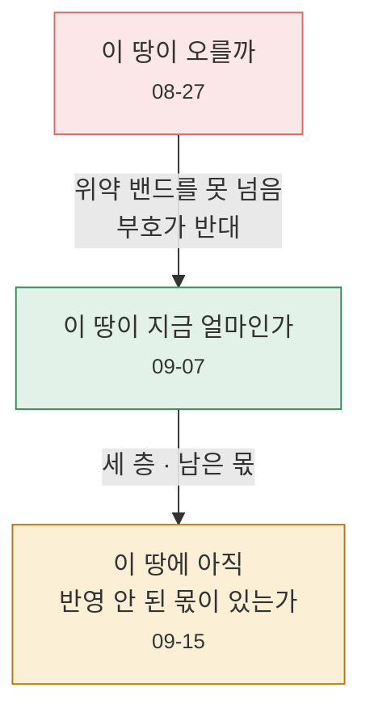

# 8막 · 지금 여기

**2026-09-15**

---

## 작업판

누가 무엇을 하고, 무엇이 무엇을 기다리는지.

| | 대기·진행 | 막힘 | 완료 |
|---|---|---|---|
| **나** | 10 | — | 1 |
| **Claude** | 15 | 1 | 1 |

### 화면

| 누구 | 무엇 | 상태 |
|---|---|---|
| Claude | 지도가 멎던 뿌리 — `fetchData` 가 `boot()` 안에 갇힘 | ✅ 완료 |
| Claude | 실거래 **'전부'** 표시 — 캔버스 또는 나눠 그리기 | ⏳ 대기 |
| Claude | 실거래 기록 얇게 **382B → 105B** (좌표·단가·연월·종류만) | ⏳ 대기 |
| Claude | 시·도 조각으로 나눠 버킷에 | ⏳ 대기 |
| 나 | 안성 덕봉리 시점수정 표시 확인 | ⏳ 대기 |
| 나 | 지도 당겨 보기 확인 | ✅ 완료 — **재현해 준 덕에 뿌리를 찾았다** |

### 자료 수집

| 누구 | 무엇 | 상태 |
|---|---|---|
| Claude | 지가변동률 매달 적재 | 🔄 진행 |
| Claude | 못 이은 지역 30곳 — 북구·동구·중구·고성군 | 🔄 진행 |
| Claude | 건축인허가 훑기 (한 판 65분 · 남은 동 19,057) | ⏳ 대기 |
| Claude | 산업단지 **지정일** | 🔄 진행 |
| Claude | 부산·대구 자치구 지방세 표 | ⏳ 대기 |
| Claude | 지오코딩 mask probe | 🔴 **막힘 — 브이월드 502** |
| 나 | 공공데이터포털 활용신청 4건 | ⏳ 대기 |

### 산식

| 누구 | 무엇 | 상태 |
|---|---|---|
| Claude | 시점수정 = 지가변동률 (고시 `[610-1.5.2.3.1]`) | 🔄 진행 |
| Claude | 감정평가서 **2차 164건** 판독 | 🔄 진행 |
| Claude | 그 밖의 요인 칸을 **읍·면까지** | ⏳ 대기 |
| Claude | **강원·임야 어긋남 원인** | ⏳ 대기 |

### 인프라 · 원장 · 결정

| 누구 | 무엇 |
|---|---|
| Claude | Supabase `SECURITY DEFINER` 함수 7개 검토 |
| Claude | **Vercel 26.76GB 수치의 성질** — 배포 3개·1.5MB 인데 왜 그 수치인지 |
| Claude | Actions 캐시 정리 — 한 판 2.2GB / 한도 10GB |
| 나 | Supabase 유출 비밀번호 보호 켜기 |
| 나 | 회원 전용 파일 2건 · 원장 시트 5건 |
| 나 | 광주·전남 2026 통합 — 새 코드로 이을지 |
| 나 | 보류 셋 — 매물 API · 경·공매 · 방향 전환 |

---

## 아직 모르는 것 — 적어 두는 이유

> **Claude**
> 확인한 것만 적는 것이 이 저장소의 규칙이라, **확인 못 한 것도
> 적어 둡니다.** 안 적으면 다음에 누가 "그건 해결됐겠지" 하고 넘어갑니다.

| # | 모르는 것 | 왜 중요한가 |
|---|---|---|
| 1 | **가려진 지번으로 얻은 '지번단위' 좌표가 진짜인가** | 1막에서 "88% 가 지번단위" 라고 기뻐했던 그것. 국토부는 토지 지번을 `1**` 로 가려 주는데, 우리 코드는 **좌표가 오기만 하면 `parcel` 로 적습니다.** 지번을 실제로 맞혔는지 확인하지 않습니다 |
| 2 | Vercel 26.76GB 의 성질 | 지연 반영인지 청구 기간 누적인지 끝내 못 갈랐다 |
| 3 | 검사판이 z12 이상에서 멎는 것 | 자바스크립트는 다 끝나고 그 뒤 렌더러가 CPU 300% 로 몇 분을 돈다. '세계 경계 탓' 이라는 제 가설은 틀렸다 |
| 4 | 강원·임야가 왜 어긋나는가 | 평가서로는 안 풀리는 둘 |

1번에 대해 이렇게 적어 두었습니다.

> **Claude**
> 스무 해 표본을 세어 보니 **2006~2023 은 온전한 지번이 0%**, 2024~25 만
> 11% 입니다. 그런데 그 해들에도 `geocode_level='parcel'` 이 20~29% 씩
> 붙어 있습니다.
>
> ```python
> if lat is not None:
>     return lat, lon, "parcel"      # ← 맞혔는지 확인하지 않는다
> ```
>
> 셋 중 하나입니다.
> **(가)** 브이월드가 번호를 무시하고 동 중심점을 준다 — 그러면 그
> 20~29% 는 사실 `umd` 이고 **이름이 거짓말을 하고 있습니다.**
> **(나)** 아무 필지나 골라 준다 — 더 나쁩니다.
> **(다)** 정말로 맞힙니다.
>
> **이것을 확인하기 전에는 실거래 표시 늘리기를 더 진행하지 않습니다.**
> 지금 '정확' 이라 표시된 20~29% 가 사실이 아니면, 그 위에 점을 늘리는
> 것은 **틀린 것을 늘리는 일**입니다.

*(그리고 이 확인은 지금 **막혀 있습니다** — 브이월드가 502 를 주고
있습니다.)*

---

## 20일 · 숫자로

| | 08-27 | 09-15 |
|---|---|---|
| 교통량 | 2025년 한 해 | **2003~2025 · 274개월 · 영업소 561** |
| 실거래 | 0 | **1,179만 건** |
| 좌표 붙은 거래 | — | 29.5% → **96.7%** |
| 필지 특성 | 0 | **434만 필지** |
| 감정평가서 원장 | 0 | **443건** (2차 164건 판독 중) |
| 지도 자동 검사 | 0 | **515건** |
| 배포 크기 | — | 65MB → **1.5MB** |
| 문서 | 0 | **64편** |
| 확정된 축 | 0 | **6축** |
| **낸 미래 가치 숫자** | 0 | **0** ← 문이 닫혀 있다 |

마지막 줄이 이 프로젝트에서 가장 마음에 드는 줄입니다.

---

## 세 번 바뀐 질문



| | 질문 | 왜 바뀌었나 |
|---|---|---|
| 1 | 이 땅이 **오를까** | 위약 밴드를 못 넘었고, 부호가 밴드마다 뒤집혔다 |
| 2 | 이 땅이 **지금 얼마인가** | 감정평가는 **검산할 답**이 있다. "도로를 접하는 가" |
| 3 | 이 땅에 **아직 반영 안 된 몫이 있는가** | 뚫린 IC 는 이미 현재 가치 안에 있다. 곱할 것은 **남은 몫**뿐 |

첫 질문을 버린 게 아닙니다. **세 번째 질문 안에 들어가 있습니다** —
다만 이제 **문을 통과해야** 나옵니다.

---

## 배운 것 열 가지

| # | | 어디서 |
|---|---|---|
| 1 | **검증하면 반드시 성공하는 가설은 검증할 가치가 없다** | 1막 |
| 2 | **위약 밴드는 성공을 확인하는 장치가 아니라 발표를 막는 장치다** | 3막 |
| 3 | **자료를 늘려도 병목은 옮겨갈 뿐 사라지지 않는다** | 3막 |
| 4 | **검산할 답이 있는 문제로 옮겨가라** | 4막 |
| 5 | **사용자에게 방법을 설명하지 마라. 필요성이 먼저다** | 5막 |
| 6 | **확인하기 전에 그럴듯한 이야기를 만들지 마라** | 6막 (세 번) |
| 7 | **초록불을 믿지 마라 — 할 일이 없어 끝난 것도 `success` 다** | 6막 |
| 8 | **얼마나 바꿀지는 감이 아니라 자료가 정한다** | 7막 |
| 9 | **검증이 인자를 떨어뜨릴 수 있어야 검증이다** | 7막 (모멘텀) |
| 10 | **짐작을 주석으로 굳히지 마라** | 7막 (리 경계 · 가려진 지번) |

그리고 이 열 개를 관통하는 것 하나.

> **못 내는 쪽이 기본이다.**
>
> 잡음의 최댓값을 고원이라 부르면, 남은 몫은 **잡음의 폭을 값으로 파는
> 짓**이 됩니다. 견줄 자리가 없는 땅에 숫자를 만들어 내지 않습니다.
> 산출 보류에는 **왜 보류인지**를 적습니다.

---

## 다음

가장 가까운 것 셋.

1. **필지 단위 이벤트 스터디** — 읍·면·동 중앙단가는 사건을 재기에
   굵었습니다. 거리 밴드 처치군 · 같은 시군구 대조군 · 영업소 클러스터
   SE · 개통 전 연도별 계수로 평행추세.
2. **도로 사다리 울타리 좁히기** — 시군구 → 읍·면·동. '길이 좋아서' 와
   '길 좋은 동네라서' 를 가른다.
3. **가려진 지번 확인** — 브이월드가 응답을 돌려주는 대로.

그리고 언젠가, 문이 열리면.

---

| ← | |
|---|---|
| [7막 · 저울과 문](07-scales-and-gates.md) | [차례로](README.md) |

---

> 이 저장소의 산출물은 **과거 실거래 자료 기반 통계**이며 미래 가격을
> 보장하지 않습니다. 상관관계는 인과가 아닙니다.
