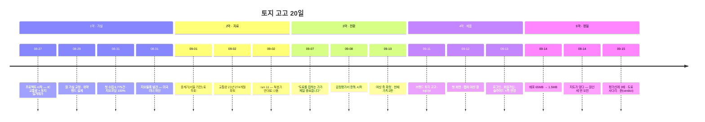

# 좌충우돌 지도 서비스 제작기

**「고속도로 교통량으로 땅값을 맞힐 수 있을까」 에서 출발해
「이 땅이 지금 얼마인가」 에 도착하기까지 — 20일간의 기록.**

사람 하나와 Claude 하나가 주고받은 1대 1 대화로 만든 서비스
[toji.fyi](https://toji.fyi) 의 제작기입니다. 잘 된 이야기가 아니라
**틀렸다가 고친 이야기**입니다. 가설이 부서지고, 부호가 반대로 나오고,
내가 내 설정 파일로 배포를 막고, 하루에 세 번 같은 종류로 틀렸습니다.

---

## 등장인물

| | 누구 | 하는 일 |
|---|---|---|
| **나** | 사람 | 방향 · 결정 · 계정 · 신청 · 감정평가서 원장 · 그리고 **"그거 아닌 것 같은데"** |
| **Claude** | 나 | 코드 · 수집 · 산출 · 검사 · 문서 · 그리고 **틀렸다고 적는 일** |

---

## 차례

| 막 | 제목 | 기간 | 한 줄 |
|---|---|---|---|
| 1 | [질문이 틀렸다](01-the-wrong-question.md) | 08-27 ~ 08-31 | "교통량 많으면 땅값 비싸다" 를 검증하면 반드시 성공하고, 그래서 쓸모없다 |
| 2 | [미국에서는 문이 안 열린다](02-the-wall.md) | 08-31 ~ 09-02 | 러너가 애리조나에 있었다. 한국 공공 API 는 TCP 핸드셰이크조차 안 받아준다 |
| 3 | [부호가 반대다](03-the-sign-was-backwards.md) | 09-02 ~ 09-05 | 118만 건을 돌렸더니 교통량이 늘수록 땅값이 **내렸다** |
| 4 | [도로를 접하는 가](04-the-road.md) | 09-07 ~ 09-10 | 한 문장이 프로젝트의 축을 갈아끼웠다 |
| 5 | [토지 고고](05-the-product.md) | 09-10 ~ 09-13 | 이름 · 색 · 첫 화면 · 로그인. 그리고 코드에서 호칭 294곳을 지운 날 |
| 6 | [하루에 세 번 틀리다](06-three-mistakes-in-one-day.md) | 09-14 | 배포가 막히고, 지도가 멎고, 원인을 세 번 잘못 짚었다 |
| 7 | [저울과 문](07-scales-and-gates.md) | 09-14 ~ 09-15 | 숫자를 **안 내는** 장치를 만들기 시작했다 |
| 8 | [지금 여기](08-where-we-are.md) | 09-15 | 작업판 · 남은 것 · 배운 것 |

---

## 연표 한 장

---

## 지금까지 쌓인 것 — 숫자로

| | |
|---|---|
| 교통량 | 2003-01 ~ 2025-12 · **274개월 23년** · 영업소 561곳 |
| 실거래 | 2006 ~ 2025 · **1,179만 건** · 좌표 붙은 것 96.7% |
| 필지 특성 | **434만 필지** — 지목 · 용도지역 · 도로접면 · 형상 · 지세 |
| 감정평가서 원장 | 52건 → **443건** |
| 개발 사건 | 산단 · 택지 · 도시개발 **189건** · 좌표 100% |
| IC 개통 판정 | **249곳** (좌측절단 · 코드승계 · 재개통 걸러낸 뒤) |
| 지도 자동 검사 | **515건** (8-27 에는 0건이었다) |
| 배포 크기 | 65MB → **1.5MB** |

---

## 이 기록에 대하여 — 어디까지가 사실인가

**대화 원문은 남아 있지 않습니다.** 세션이 보관 처리되면서 주고받은 말
자체는 복원하지 못했습니다. 그래서 이 제작기는 **남아 있는 사료로
재구성한 것**이고, 그 경계를 문서 안에서 표시했습니다.

| 표시 | 뜻 | 출처 |
|---|---|---|
| > **지시** 로 시작하는 인용 | **원문 그대로**입니다 | 커밋 메시지·문서에 그날 옮겨 적힌 지시문 |
| 표 · 수치 · 로그 | **실제 산출물**입니다 | 커밋 본문 · `docs/*.md` · 워크플로 로그 |
| 캡처 | **실제 화면**입니다 | 「토지 고고 수정 이력」 아티팩트에 박혀 있던 PNG |
| **나** / **Claude** 의 말풍선 | **재구성**입니다 | 위 세 가지를 대화로 옮긴 것 |

말풍선의 **뜻**은 사료에 근거하지만 **문장**은 제가 다시 쓴 것입니다.
지어낸 사건은 없고, 확인 못 한 것은 확인 못 했다고 적었습니다.

주 사료는 이렇습니다.

- 커밋 55개 — 이 저장소는 커밋 메시지에 **무엇이 틀렸고 왜 틀렸는지**를
  적는 규칙으로 써 왔습니다. 그래서 커밋 로그 자체가 일지입니다.
- `docs/` 문서 64편 — `hypothesis.md` · `results.md` · `finding-geoblock.md` ·
  `six-axes-method.md` · `future-value.md` 등
- 아티팩트 6점 — 수정 이력 · 작업판 · BM 대장 · 국면판 · 인자판 · 실행 가이드

---

## 읽는 법

시간 순서대로 1막부터 읽으면 됩니다. 기술적 세부가 궁금하지 않다면
각 장의 **「그날 배운 것」** 절만 읽어도 이야기는 이어집니다.

> 이 기록에 나오는 모든 산출물은 **과거 실거래 자료 기반 통계**이며
> 미래 가격을 보장하지 않습니다. 상관관계는 인과가 아닙니다.
